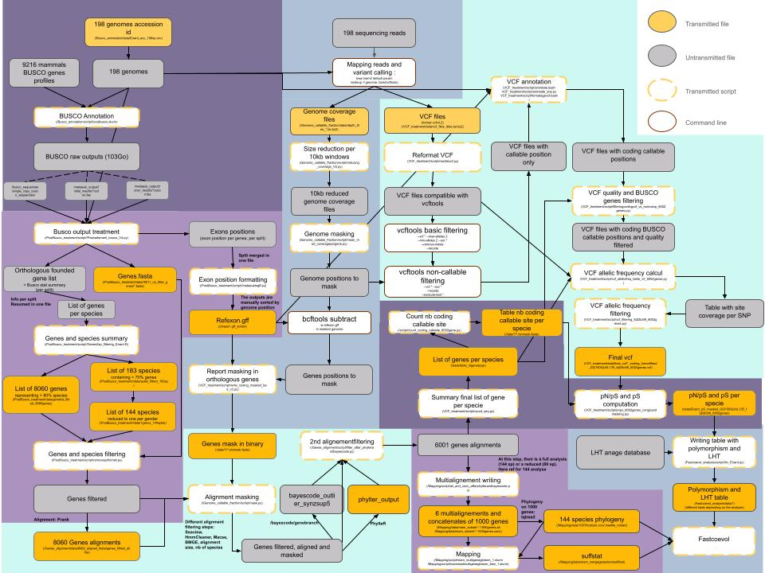

# Mam_Ne

This directory contain the data and scripts for the analyses presented in the manuscript _Empirical validation of the nearly neutral theory at divergence and population genomic scale across 150 placental mammal genomes_ (Bastian, Enard, Lartillot, https://doi.org/10.1101/2025.04.17.649326). 

**Main goal and analysis**

The aim of this study is to compare estimators of effective population size with measures of selection efficacy at phylogenetic scale (using life history traits and the ratio of non-synonymous over synonymous substitution rates, dN/dS) and at population scale (using synonymous heterozygosity pS and the ratio of non-synonymous over synonymous heterozygosity pN/pS).
To do this, we annotated around 150 mammalian genomes and identified approximately 8000 single-copy orthologous genes (6000 after quality filtering).\
We then aligned the genes and reconstructed a phylogeny. The genes were also used to estimate the dN/dS and its variation between species.\
In parallel, we performed a variant calling analysis for each genome. This generated VCF and coverage files.\
The vcf files were used to identify the heterozygous positions within the genes, which were then used to compute an estimate of pN/pS and of pS for each species.\
The coverage files were used to determine the callable fraction of the data.\
Different filtering steps were performed on the alignments and vcf files.
Alignments, pS,  pN/pS, phylogeny and life history traits were combined and given as input to the Fastcoevol software (github.com/bayesiancook/bayescode.git), which returned an estimate of the correlation matrix between traits and a reconstruction of the evolution of each trait along the phylogeny.

**Notes for the users**

The different directories corresponds to the differents steps of the analysis. Their is a readme with more detailed informations in each of them.\
In this git repository, only the scripts are provided (and some light data files). The data mentionned in the different readme will be available soon or by request.

The path mentioned in the scripts correspond to the path used localy for the analysis. These should be edited so as to match them with your own directory.
The <input> and <output> information are not always the exact arguments that should be given to the scripts. Instead, they are juste indications for the users to get a better understanding of how the scripts work.

The pipeline and the usage of scripts and data are summarised in the figure below. The color code is as follows: yellow represents the data (filled in yellow) and the scripts (circled in yellow); grey boxes represent the intermediate data.
For economy, we have opted not to provide the data that are simple and/or relatively inexpensive to regenerate. All scripts are provided. If nothing is provided for the input of a given step of the analysis, this means that the processing was done by hand, without scripting, in a few lines of code.
The coloured backgrounds identify the 8 main steps of the process and refer to the steps presented in the various folders in the directory (except for /144to89sp and /Correlation_analysis).

